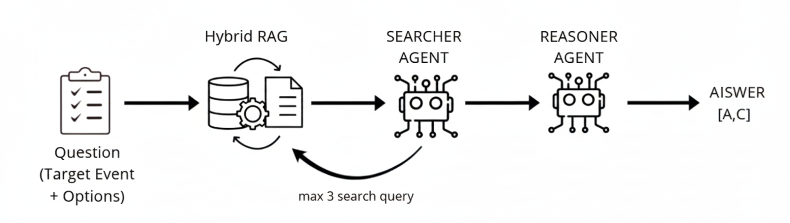

# LLM Abductive Event Reasoning - Project Report



**Date:** January 2026  
**Project:** SemEval 2026 Task 12 - Abductive Event Reasoning  
**Institution:** Politecnico di Torino  


---

## Table of Contents

1. [Executive Summary](#1-executive-summary)
2. [Project Structure](#2-project-structure)
3. [Technical Architecture](#3-technical-architecture)
   - [Multi-Agent Pipeline](#31-multi-agent-pipeline)
   - [Retrieval-Augmented Generation (RAG)](#32-retrieval-augmented-generation-rag)
4. [Core Components](#4-core-components)
   - [Agents Module](#41-agents-module)
   - [RAG Module](#42-rag-module)
5. [Utilities Module](#5-utilities-module)
6. [Evaluation Framework](#6-evaluation-framework)
   - [Dataset Structure](#61-dataset-structure)
   - [Checkpoint Management](#62-checkpoint-management)
   - [Metrics](#63-metrics)
7. [Advanced Features](#7-advanced-features)
8. [Setup & Installation](#8-setup--installation)
9. [Execute Evaluation](#9-execute-evaluation)
   - [Configuration](#91-configuration)
10. [Replication](#10-replication)
11. [Performance & Results](#10-performance--results)

## 1. Executive Summary

This project implements a comprehensive framework for **Abductive Event Reasoning** using Large Language Models (LLMs) combined with Retrieval-Augmented Generation (RAG). The system is evaluated on the SemEval 2026 Task, which requires identifying the most plausible direct cause(s) of a given event from four options.

### Key Components:
- **Multi-Agent Reasoning Pipeline**: Search, Reason, Extract agents
- **Hybrid Retrieval Chain**: Combining semantic and keyword-based search
- **CausalRAG**: Custom knowledge graph-based retrieval system
- **Model Evaluation Framework**: Comprehensive metrics and checkpoint management

---

## 2. Project Structure

```
Project/
├── agents/
│   ├── extractor.py          # Final answer extraction from reasoning
│   ├── reasoner.py           # Causal inference reasoning engine
│   └── searcher.py           # Evidence sufficiency evaluation
├── prompts/
│   └── template.py           # Centralized system prompt definitions
├── rag/
│   ├── CausalRAG.py          # Graph-based causal retrieval system
│   └── RAGChain.py           # Hybrid semantic/keyword retrieval chain
├── utils/
│   ├── data_loader.py        # Dataset loading utilities
│   ├── model_utils.py        # Model initialization 
│   └── output_utils.py       # Scoring
├── latex/                     # Paper formatting templates
├── dataset/                   # Training/evaluation data storage
├── results/                   # Evaluation outputs
├── experiments_guide_CausalRAG.ipynb
├── experiments-guide-kaggle.ipynb
├── notebook_quickstart.ipynb
└── README.md       # Comprehensive project documentation
```

---

## 3. Technical Architecture

### 3.1 Multi-Agent Pipeline

The system implements a two-agent reasoning pipeline:

```
┌─────────────────────────────────────────┐
│   1. SEARCH AGENT (Evidence Evaluator)  │
│   ────────────────────────────────────  │
│   • Evaluates sufficiency of context    │
│   • Generates targeted search queries   │
│   • Returns: is_sufficient or queries   │
└──────────────┬──────────────────────────┘
               │
               ▼
┌─────────────────────────────────────────┐
│   2. REASONER AGENT (Causal Inference)  │
│   ────────────────────────────────────  │
│   • Performs abductive reasoning        │
│   • Analyzes temporal precedence        │
│   • Evaluates causal mechanisms         │
│   • Returns: reasoning, answer set      │
└──────────────┬──────────────────────────┘
               │
               │
               ▼
        Final Prediction
```

### 3.2 Retrieval-Augmented Generation (RAG)

#### RAGChain Component
- **Hybrid Retrieval**: Combines BM25 (keyword-based) and semantic (bi-encoder) search
- **Multi-Query Strategy**: Generates different query perspectives
- **Intelligent Boosting**: Keywords specific to options are boosted while excluding question subjects
- **Cross-Encoder Reranking**: Uses sentence-transformers for relevance scoring

**Key Methods:**
```python
retrieve_hybrid()        # Semantic + keyword fusion
retrieve_and_rerank()    # Final ranking with cross-encoder
search()                 # Specific fact retrieval
```

#### CausalRAG Component
- **Knowledge Graph Construction**: Extracts causal relations from documents using Qwen
- **Graph-based Expansion**: Bidirectional path exploration from query nodes
- **Causal Path Finding**: Identifies direct and indirect causal connections
- **Automatic Node Merging**: Deduplicates similar events using similarity matching

**Key Methods:**
```python
extract_causal_graph_manual()    # LLM-based causal extraction
retrieve_relevant_nodes()        # Hybrid node retrieval
expand_nodes()                   # BFS expansion
find_all_causal_paths()          # Path discovery
find_partial_causal_paths()      # Partial matching approach
generate_text_summary()          # Chain synthesis
```

---

## 4. Core Components

### 4.1 Agents Module

#### `searcher.py` - Evidence Evaluator
**Role**: Determines if current context is sufficient for decision-making

**Input**: Context, Event, Options (A-D)

**Output**: is_sufficient or query['query1','query2']


**Strategy**: Relevance Filter + Verification Logic

#### `reasoner.py` - Causal Inference Engine
**Role**: Performs abductive reasoning on causal relationships

**Input**: Context, Event, Options

**Output**: Final Answer [A,B]


**Key Constraints**:
- DIRECT CAUSE: Max 1 intermediary step
- TEMPORAL PRECEDENCE: Cause must precede effect
- CAUSAL MECHANISM: Logical link must exist
- COUNTERFACTUAL: Effect unlikely without cause
- MULTI-CAUSALITY: Multiple options can be correct

**Special Cases**:
- ADMINISTRATIVE TRIGGERS: Formal acts count as direct causes
- INTENTIONAL GOALS: Plans/intentions are direct causes
- INSTITUTIONAL RESPONSE: Events triggering official actions

#### `extractor.py` - Output Parser
**Role**: Extracts final answer from reasoning text

**Input**: Reasoning text with answer markers

**Output**: List of letters `['A', 'B']`

**Handling**:
- Multiple formatting styles (Option A, [A], A., etc.)
- Duplicates removal
- Empty response fallback

### 4.2 RAG Module

#### `RAGChain.py` - Semantic & Keyword Fusion

**Initialization**:
```python
RagChain(
    embedding_model,        # Bi-encoder for semantic search
    reranker,              # Cross-encoder for ranking
    k_per_option=20,       # Candidates per option
    k_final=2,             # Final returned chunks
    chunk_size=800,        # Document chunk size
    chunk_overlap=150      # Overlap between chunks
)
```

**Processing Pipeline**:
1. **Doc Splitting**: Sentences grouped into chunks respecting size limits
2. **Embedding**: All chunks encoded to dense vectors
3. **Multi-Query Retrieval**: 3 perspectives per option encoded
4. **Similarity Computation**: Max-pooling of similarity scores
5. **Keyword Boosting**: Option-specific terms increase scores
6. **Deduplication**: Identical chunks merged
7. **Reranking**: Cross-encoder provides final relevance scores

**Formulas**:
```
combined_score = max(similarity_query1, query2, query3) + keyword_boost
keyword_boost = 0.1 × Σ(2.0 for kw in option_keywords if kw in chunk)
```

#### `CausalRAG.py` - Knowledge Graph-Based Retrieval

**Core Data Structures**:
```python
graph: nx.DiGraph()           # Nodes: events, Edges: causal relations
node_to_content: Dict         # Node ID -> full event description
vector_store: FAISS           # Dense embeddings for semantic search
bm25_retriever: BM25Retriever # Sparse retrieval for exact matches
```

**Graph Extraction**:
```
LLM Prompt
    ↓
JSON Parsing: {"cause_atomic", "cause_full", "relation", "effect_atomic", "effect_full"}
    ↓
Graph Construction: Add nodes and edges with metadata
    ↓
Vector Store Indexing: Embed all node contents
```

**Retrieval Strategy**:
1. **Reciprocal Rank Fusion**: Combines BM25 and semantic rankings
   ```
   rrf_score = Σ(1 / (k_constant + rank)) across all retrievers
   k_constant = 60 (standard RRF value)
   ```

2. **Bidirectional Expansion**:
   - Forward expansion: Find what causes the cause
   - Backward expansion: Find what is caused by the effect
   - Breadth-first search with s=3 expansion steps

3. **Path Finding**:
   - All simple paths from cause to effect nodes
   - Sorted by length (shorter = stronger causality)
   - Limited to top k paths

4. **Synthesis**:
   - Serialize edges into natural language chains
   - Synthesize with LLM for coherent narrative

---

## 5. Utilities Module

### 5.1 `data_loader.py`
- **load_jsonl()**: Loads line-delimited JSON files
- **load_json()**: Loads standard JSON files
- **index_docs_by_topic()**: Groups documents by topic_id

### 5.2 `model_utils.py`
- **load_model()**: Initializes quantized LLM with proper config
- **format_qwen_prompt()**: Structures prompts using official template

**Key Features**:
- Automatic GPU/CPU device selection
- Context truncation to max_total_chars
- Official Qwen/Llama chat template application

### 5.3 `output_utils.py`
- **clean_response()**: Extracts letters A-D from any text format
- **calculate_score()**: Computes exact/partial/wrong scoring
  ```
  exact_match (1.0) : Prediction == Golden
  partial_match (0.5): Prediction ⊆ Golden
  wrong (0.0)        : Otherwise
  ```
- **print_metrics()**: Displays comprehensive evaluation results

---

## 6. Evaluation Framework

### 6.1 Dataset Structure

**questions.jsonl**:
```json
{
  "id": "uuid",
  "topic_id": 1,
  "target_event": "Event description",
  "option_A": "Candidate cause A",
  "option_B": "Candidate cause B",
  "option_C": "Candidate cause C",
  "option_D": "Candidate cause D",
  "golden_answer": "A,B"
}
```

**docs.json**:
```json
[
  {
    "topic_id": 1,
    "docs": [
      {"title": "...", "content": "..."},
      ...
    ]
  }
]
```

### 6.2 Checkpoint Management

**Purpose**: Resume evaluation from checkpoints to avoid recomputation

**Checkpoint Format** (JSONL):
```json
{
  "uuid": "question_id",
  "topic_id": 1,
  "target_event": "...",
  "options": ["A_text", "B_text", "C_text", "D_text"],
  "golden_raw": "A,B",
  "prediction_set": ["A"],
  "reasoning_response_raw": "...",
  "score": 0.5,
  "search_queries": ["query1", "query2"],
  "total_iteration_queries": 2,
  "context": "..."
}
```

**Features**:
- Incremental checkpoint writing (append mode)
- UUID-based deduplication (skip already processed)
- Running statistics update
- Wandb integration for remote logging

### 6.3 Metrics

**Scoring System**:
- **Exact Match (1.0)**: All predicted letters are correct and complete
- **Partial Match (0.5)**: Some predicted letters are correct (subset)
- **Wrong (0.0)**: Any incorrect letter in prediction

**Reported Metrics**:
```
Total Questions: N
Correct Answers: X (X/N %)
Partial Answers: Y (Y/N %)
Wrong Answers:   Z (Z/N %)
Weighted Score:  (X + 0.5*Y) / N %
```

---

## 7. Advanced Features

### 7.1 Iterative Search Loop

```
Initial Context
       ↓
[Search Agent]
       ↓
Sufficient? ←→ No ─→ [Generate Queries]
       │              ↓
      Yes        [Search & Augment Context]
       │              ↓
       └──────────────┘
       ↓
[Reasoning Agent]
       ↓
Final Answer
```

---

## 8. Setup & Installation

**Prerequisites**:
- Python 3.9 or higher
- CUDA-capable GPU (recommended for 4-bit quantization)
- Minimum 16GB VRAM (for models with 4-bit quantization)

**Step 1: Install Dependencies**
```bash
pip install -r requirements.txt
```

**Key Dependencies**:
- `transformers` - Hugging Face model loading and inference
- `bitsandbytes` - 4-bit quantization support
- `langchain` - Chain orchestration
- `torch` - Deep learning framework
- `sentence-transformers` - Semantic embeddings
- `wandb` - Experiment tracking and logging
- `networkx` - Knowledge graph management
- `pandas`, `numpy` - Data processing


## 9 Execute Evaluation

**Main Entry Point**: `run_eval.py`

**To run the full evaluation pipeline**:
```bash
python run_eval.py
```

### 9.1 Configuration

To modify evaluation parameters, edit the configuration section in `run_eval.py`:
- `dataset_path`: Path to the unzipped dataset folder
- `output_file`: Output path
- `use_wandb`: Enable WandB logging
- `use_debug`: Enable debug during eval loop
- `search_steps`: Number of iterations of the search agent
- `k_per_option`: Number of candidate documents retrieved per option (default: 10)
- `k_final`: Number of final documents returned after reranking (default: 5) 
 
---

## 10. Replication

To replicate the full evaluation pipeline **without running the entire codebase manually**, use the provided Jupyter notebook: **[notebook_quickstart.ipynb](notebook_quickstart.ipynb)**

This notebook provides an end-to-end, executable walkthrough of the evaluation process and is the **recommended entry point for replication**.

### What the notebook does
- Loads the SemEval-style dataset and associated documents
- Runs the multi-agent loop (Search → Reason → Extract)
- Computes evaluation metrics and saves checkpoint outputs

## 11. Performance & Results

### 11.1 Evaluation Metrics

Results are saved in checkpoint format (JSONL) with the following fields:
- `uuid`: Question ID
- `score`: Exact/Partial/Wrong (1.0/0.5/0.0)
- `prediction_set`: Predicted answer letters
- `golden_raw`: Ground truth answers
- `total_iteration_queries`: Number of search iterations
- `reasoning_response_raw`: Full reasoning text


---

**Project Repository**: [LLM-abductive-event-reasoning](https://github.com/irenebartolini02/LLM-abductive-event-reasoning)

---
